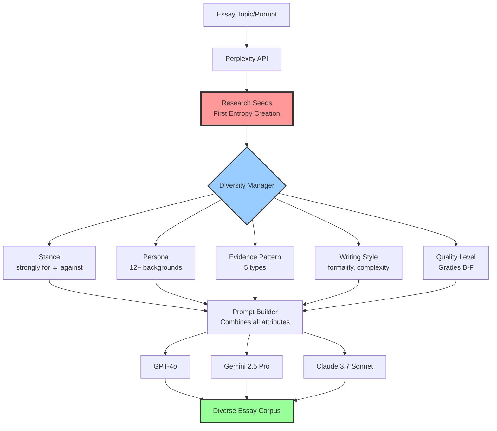

# Synthetic Essay Generator

A sophisticated system for generating diverse, authentic-looking student essays for educational demonstrations. Uses multiple LLMs and a multi-dimensional diversity framework to create realistic essay corpora.

## Purpose

Originally created to seed an LMS course with synthetic data to create a demo Canvas environment for my presentation to educators on AI usage. There was no simple dataset of bulk, authentic looking student essays on single topics (I looked!). This projects aims to satisfy that gap and generate authentic-looking essays to populate a sandbox LMS environment. 

### Demo

See outputs in [demos](./demo/)

## Features

- **Multi-LLM Support**: Works with OpenAI, Anthropic, Google Gemini, and more via litellm
- **Research-Based Content**: Uses Perplexity API to gather real-world information for essay topics
- **Comprehensive Diversity Framework**:
  - 8 different argument stances (strongly for → strongly against)
  - 12+ student persona backgrounds
  - 5 evidence pattern types
  - Varied writing styles (formality, complexity, emotionality, confidence)
  - 5 quality grades (A-F) with realistic error patterns
- **SQLite Database**: Tracks all generation parameters and metadata
- **Markdown Output**: Clean, organized essay files with full metadata
- **Analytics Dashboard**: Generation statistics and diversity reports

## How It Works

The system transforms a simple essay prompt into a diverse corpus of authentic-looking student essays through a multi-stage process:



### Generation Flow

1. **Initial Entropy**: The Perplexity API creates the first layer of diversity by generating unique research seeds:
   - **Input - Research Angles**: 10+ different perspectives (e.g., ethical, economic, social justice, technological)
   - **Output - Structured Data**: Each seed returns 5-7 facts, 2-3 expert quotes, and credible sources
   - **Dynamic Adaptation**: Angles are customized to the specific topic
   - **Parallel Generation**: Multiple seeds generated concurrently for efficiency

2. **Diversity Attribution**: Multiple dimensions of variation are layered onto each research seed:
   - Argument stance (position and certainty)
   - Student persona (background, strengths, weaknesses)
   - Evidence patterns (how arguments are supported)
   - Writing style (formality, complexity, emotionality)
   - Quality level (grade-appropriate characteristics)

3. **Multi-Model Generation**: The enriched prompts are sent to three different LLMs, adding another layer of variation in writing patterns and expression.

4. **Result**: Each essay is unique, combining research-based content with authentic student characteristics.

## Installation

1. Clone the repository:
```bash
git clone <repository-url>
cd synthetic-essays
```

2. Install dependencies:
```bash
pip install -r requirements.txt
```

3. Set up environment variables:
```bash
cp .env.example .env
# Edit .env with your API keys
```

## Usage

### Basic Usage

Generate 60 essays on the default topic:
```bash
python main.py
```

### Custom Topic

Generate essays on a specific topic:
```bash
python main.py --topic "Discuss the impact of social media on mental health"
```

### Custom Number of Essays

Generate a specific number of essays:
```bash
python main.py --num-essays 100
```

### Full Example

```bash
python main.py --topic "Analyze the ethics of AI in healthcare" --num-essays 50
```

## Configuration

Edit `config/settings.yaml` to customize:
- Model configurations
- Temperature settings
- Output directories
- Database paths
- Batch sizes

## Output Structure

```
output/
└── <run-id>/
    ├── index.md                    # Overview of all essays
    ├── analytics.json              # Detailed analytics
    ├── summary_report.md           # Human-readable summary
    └── essay_001_strongly_for_A_ChatGPT_4o.md  # Individual essays
    └── essay_002_neutral_B_Gemini_2.5_Pro.md
    └── ...
```

## Database Schema

The SQLite database tracks:
- Research seeds (angles, facts, quotes, sources)
- Argument stances
- Student personas
- Evidence patterns
- Writing styles
- Quality levels
- Generated essays
- Generation runs

## API Requirements

You'll need API keys for:
- **OpenAI**: For GPT models
- **Anthropic**: For Claude models
- **Google/Gemini**: For Gemini models
- **Perplexity**: For research seed generation

## Architecture

The system uses a modular architecture:
- `research/`: Perplexity integration for research seeds
- `diversity/`: Managers for all diversity dimensions
- `generation/`: LLM orchestration and prompt building
- `database/`: SQLAlchemy models and data persistence
- `output/`: Markdown export and analytics
- `config/`: Settings and configuration

## Development

To extend the system:

1. Add new diversity dimensions in `diversity/`
2. Modify prompts in `generation/prompt_builder.py`
3. Add new LLM providers in `generation/llm_manager.py`
4. Extend analytics in `output/analytics.py`

## License

This project is licensed under CC BY-NC 4.0.

## Ethical Considerations

This system generates synthetic essays that emulate various student populations and writing characteristics, including:
- Non-native English speakers
- International students
- First-generation college students
- Students from diverse educational backgrounds

LLM generated texts may exhibit stereotypes or biases. This system was built for demo usage and therefore [persona emulation](./diversity/personas.py) should be heavily scrutinized in any public-facing integrations. 
